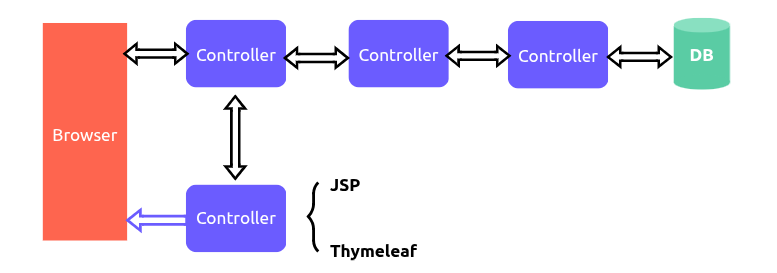
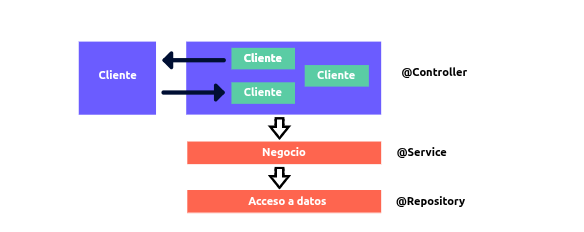

# Spring Boot

## Introduction to Spring Boot
Spring Boot is an open-source framework designed to facilitate the creation of Java-based applications.

## What is Spring?

Spring is a project ecosystem that makes Java programming easier, faster, and more secure for the development community.

## Principal Sub-projects

### Spring Boot
A sub-project of Spring that simplifies the creation process of Spring-based applications. It provides default configurations to start new Spring projects quickly without extensive manual configuration.

### Spring Data
Facilitates data access across different data stores, including both relational and non-relational databases. Its primary objective is to simplify the implementation of repositories and data services.

### Spring Cloud
A comprehensive toolkit for building distributed systems and microservice-based applications. It provides solutions for distributed configuration, service discovery, circuit breakers, load balancing, and more.

### Spring Security
An authentication and access control framework for Spring-based applications. It provides protection against common security threats, including Cross-Site Request Forgery (CSRF), brute force attacks, and more, ensuring application security.

### Spring Batch
Provides robust solutions for batch processing. It is ideal for applications that handle large volumes of data, such as data migrations and transaction processing.

### Spring Web Services
Enables the creation of contract-first web services and SOAP Web Services interoperability. It simplifies the creation of endpoints and SOAP clients efficiently.

## What Spring Boot is Not

Spring Boot is not a replacement for the Spring Framework. Rather, it is built on top of Spring Framework to provide a set of libraries and APIs that significantly simplify Spring development.

## Spring Boot Starters

A Spring Boot starter is a pre-configured dependency that simplifies the addition of specific functionalities to Spring applications. These starters contain sets of automated dependencies designed to work together and enable specific functionality. These dependencies are imported in a `pom.xml` file and are structured as follows:

```xml
<!-- pom.xml -->
<dependencies>
    <!-- starter A -->
    <!-- starter B -->
    <!-- starter C -->
</dependencies>
```

### Web Starter

The `spring-boot-starter-web` includes all necessary dependencies to develop web applications, including Spring MVC and embedded Tomcat server.

## Java Annotations

An annotation in Java is a form of metadata that provides information about a program but is not part of the program itself. Java annotations do not directly affect the operation of the code they annotate.

Annotations provide information to tools and libraries that process the code at compile time, deployment time, and runtime.

### Core Spring Boot Annotations

- **@SpringBootConfiguration**: Marks a class as the main source of configuration for a Spring Boot application.

- **@EnableAutoConfiguration**: Enables Spring Boot to automatically configure your application based on the dependencies present in the classpath.

- **@ComponentScan**: Tells Spring where to look for components, configurations, and services to automatically register them as beans.

## Spring Beans

A bean is an object managed by the Spring Inversion of Control (IoC) container. Beans are the central components in a Spring application, representing objects that are created, configured, and assembled by the Spring container.

### Bean Features

- Automatic creation and management
- Dependency injection
- Controlled lifecycle

### Defining Beans

Beans can be defined in two primary ways:
1. Using the `@Component` annotation
2. Using the `@Bean` annotation in a configuration class

## Spring MVC (Model-View-Controller)

Spring MVC is a framework within Spring that implements the Model-View-Controller pattern to build web applications. It separates the application into three main components: business logic, user interface, and control flow.

### Spring MVC Flow


### Spring MVC Architecture

#### 1. Presentation Layer (MVC Components)
- **Controller**: Manages user requests, interacts with the Business Layer, and selects the appropriate view to return to the user. Acts as an intermediary between the view and model.
- **View**: Responsible for presenting data to the user.
- **Model**: Represents the application data and business logic. In Spring MVC, models are typically Plain Old Java Objects (POJOs) that contain data and methods to manipulate that data.

#### 2. Business Layer (Service)
The business layer implements the domain-specific rules and processes of the application.
- **@Service**: Annotation used to mark a class as a service component.

#### 3. Data Access Layer (Repository)
This layer is responsible for interacting with databases and other storage systems.
- **@Repository**: Annotation used to mark a class as a data access component.
- Handles CRUD (Create, Read, Update, Delete) operations in the database.

### Spring MVC graphic


## Spring Stereotypes

Stereotypes are annotations that indicate the role of a component within the application architecture.

These annotations not only mark a class as a Spring-managed bean but also provide additional information about the purpose and functionality of the bean.

### Common Stereotypes
- **@Component**: Base annotation indicating that a class is a Spring component
- **@Service**: Indicates that a class is a service layer component
- **@Repository**: Marks a class as a data access component
- **@Controller**: Identifies a class as a web controller component

Spring defines these stereotypes as essential elements for proper application organization and functionality. They enable Spring to automatically detect and configure beans within the Spring container.

## Further Research Topics
1. Dependency Injection
2. Singleton Design Pattern

